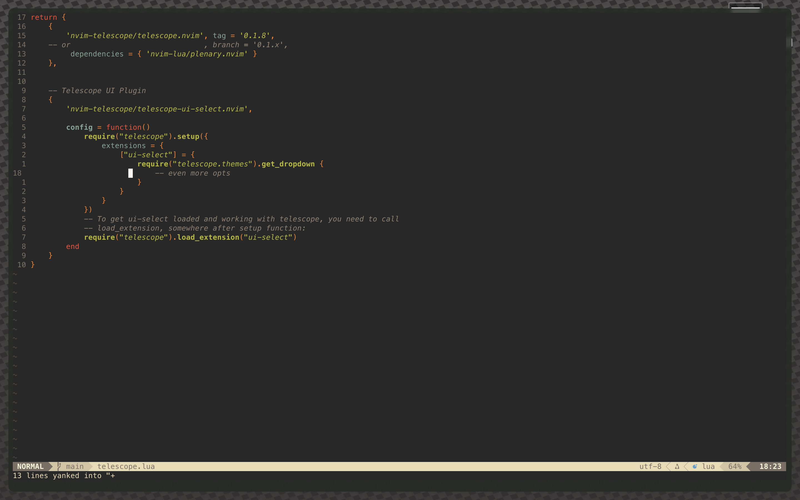
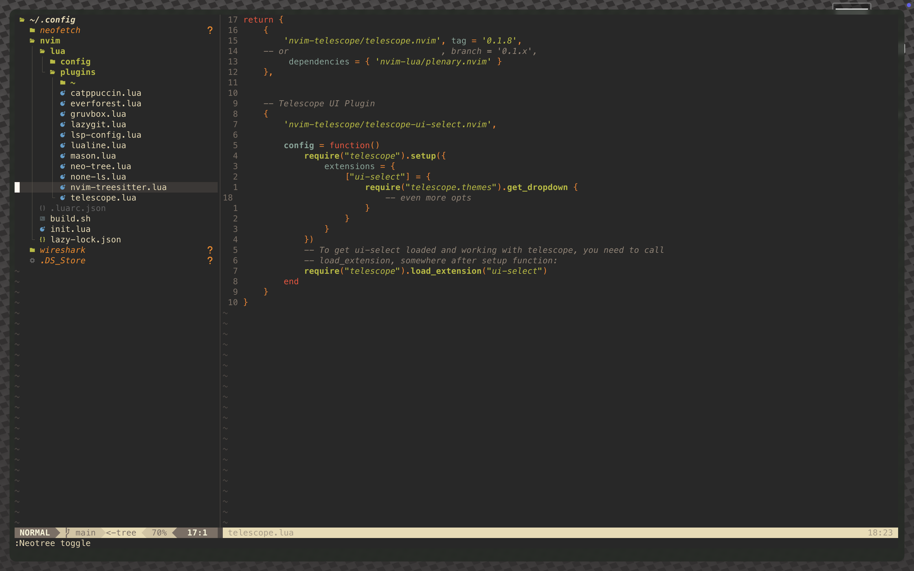
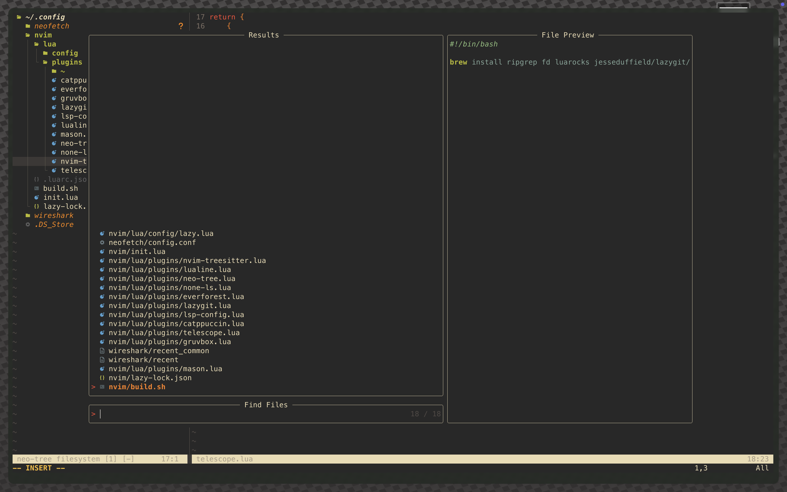
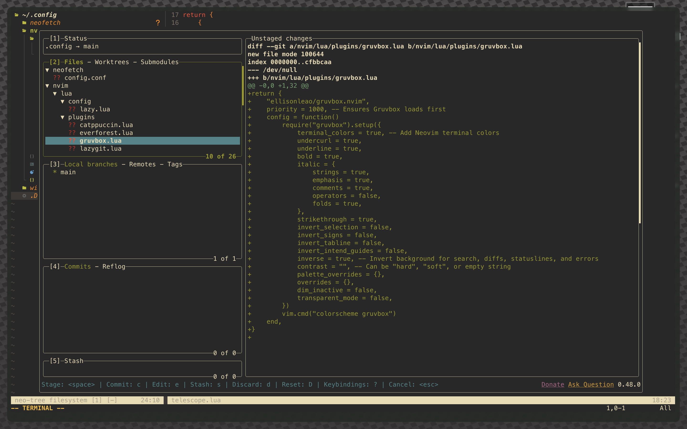
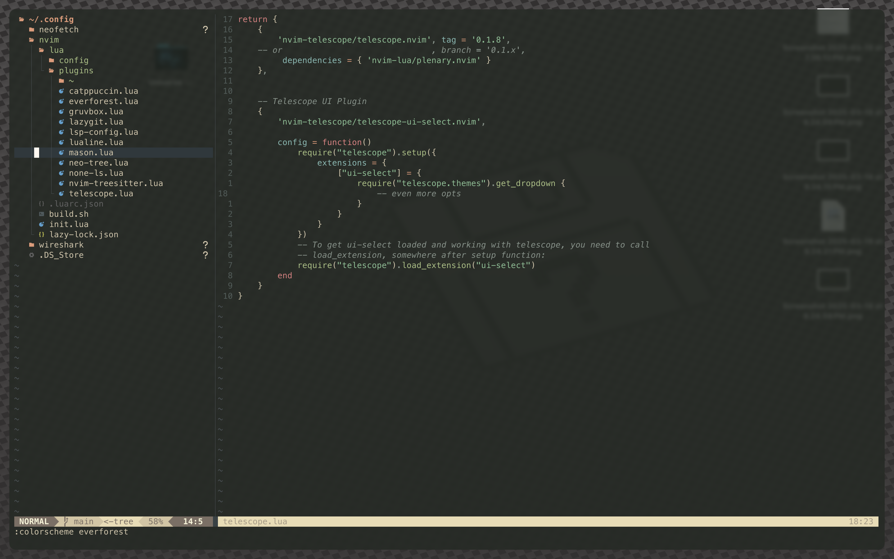

# my neovim config

## Overview
This documentation covers my Neovim setup, including plugins, themes, and configurations.

## Preview

Here are some screenshots of the Neovim setup in action:








## Installation
To install this Neovim configuration, clone the dotfiles repository into the appropriate configuration directory:

```sh
# Backup existing Neovim configuration
mv ~/.config/nvim ~/.config/nvim_backup

# Clone the repository
git clone https://github.com/NoobGrinder420/nvim-config.git ~/.config/nvim

# Open Neovim and install plugins
nvim +Lazy sync +qall
```

## Themes
- **Default Theme:** Gruvbox Dark
- **Additional Themes:** Catppuccin
- **Lualine Theme:** Gruvbox Light
- **Transparency Support:** Enabled via `Everforest` theme

## Core Plugins
- **Plugin Manager:** Lazy.nvim 
- **LSP Support:**
  - `nvim-lspconfig`
  - `mason.nvim` for LSP installation and management
- **Git Integration:** `lazygit`
- **File Explorer:** `neo-tree`
- **Fuzzy Finder:** `telescope.nvim` with Telescope UI
- **Syntax Highlighting:** `nvim-treesitter`

## LSP and Formatting
### LSP Setup
- Configured using `nvim-lspconfig`
- Managed with `mason.nvim`

### None-LS Setup
- **Web Development:**
  - Diagnostics: `eslint_d`
  - Formatting: `prettier`
- **Lua:**
  - Formatting: `stylua`
- **Python:**
  - Formatting: `isort`, `black`
- **Spell Completion:** Enabled

## Status Line
- `lualine.nvim` configured with Gruvbox Light theme

## Additional Features
- **Terminal Integration:** WezTerm compatible
- **Tree-sitter:** Enhanced syntax highlighting and parsing

This documentation provides a structured reference for the Neovim setup.
